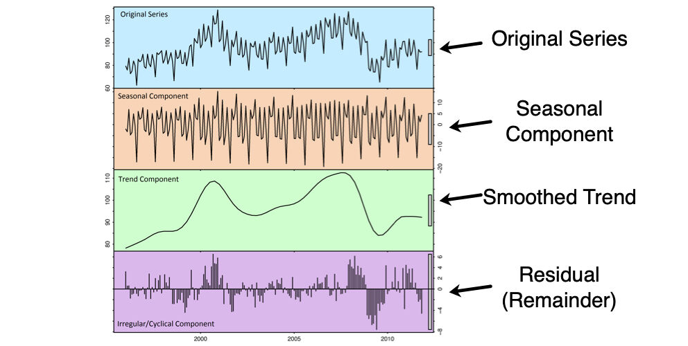
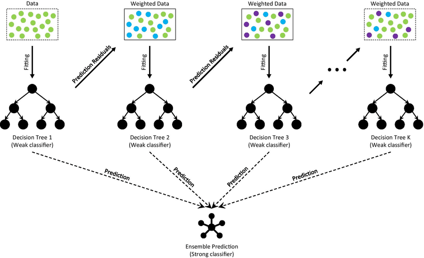

# Portfolio
---
## NYC Data Science Academy
### Acquisition Due Dilligence Automation for Smaller Firms: PCA, KMeans, and ARIMA

The creation of a methodology to automate the due diligence process for acquiring small or midsize target firms. This allows for more informed decision-making on these firms, similar to what would be performed for larger ones, but with far less overhead. I served as a lead on a project commissioned by an accounting firm to propose innovative data science automation methods. 

Image Citation:  

[Linkedin](https://www.linkedin.com/posts/mattdancho_when-learning-time-series-i-struggled-to-activity-7163923015670468612-SURj)

---
### Pandemic Effects on the Ames Housing Market and Lifestyle: RF, GradientBoosting, GeoPandas, REST API, and A/B Testing

A prediction model to assist real estate agents in their service to out-of-town clients who are planning to move to Ames from a more urban setting. To assess the factors that affect the sale price of each home, consideration will be given to the proximity of desired services (e.g., gyms, spas, organic groceries, hospitals, etc.) as well as other housing features. Additionally, the project will analyze the housing market change due to the pandemic (i.e., 2019 vs 2021 data) and determine the neighborhood preferences for this particular client group. I analyzed the pandemic effects on Ames, Iowa housing through sensitivity analysis forecasts and pre vs. post
pandemic A/B testing in Python. I also created Python API wrapper functions to request lat/long and drive time data in JSON format.

Image Citation: Deng, Haowen & Zhou, Youyou & Wang, Lin & Zhang, Cheng. (2021). Ensemble learning for the early prediction of neonatal jaundice with genetic features.

---
### Forecasting App for NY State Tax Credits: R Shiny, Lasso, and Ridge

An interactive, dynamic R Shiny dashboard application to forecast NY State Corporate Tax Credits across multiple datasets. This provides tax consultants with an insightful tool to advise these corporations, helping them make the most appropriate current and future business decisions when considering ways to offset their tax liabilities. The data used to drive this application came from an annual New York State corporation tax returns study, which only included businesses with a yearly tax liability timeframe between January 1st and December 31st. I optimized predictive models using hyper-parametrization, cross-validation, and regularization.

Image Citation: Zou, H., & Hastie, T. (2005). Regularization and variable selection via the elastic net.

